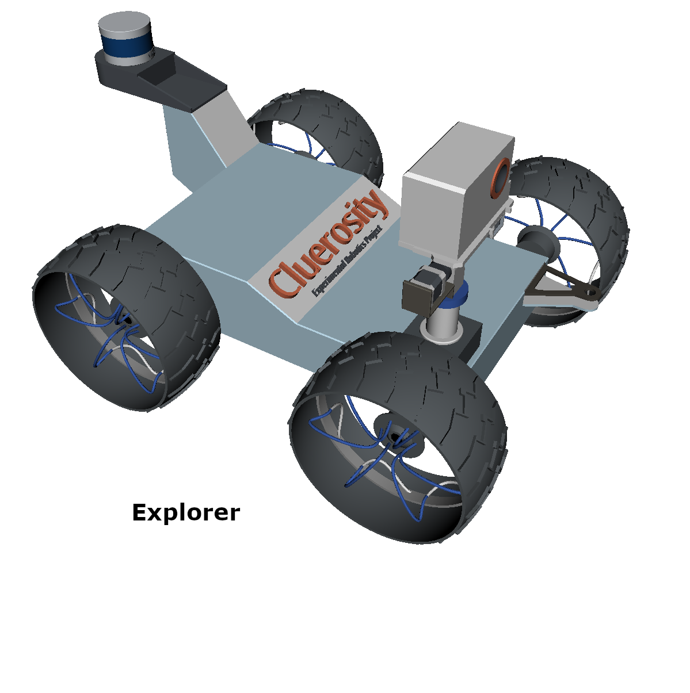
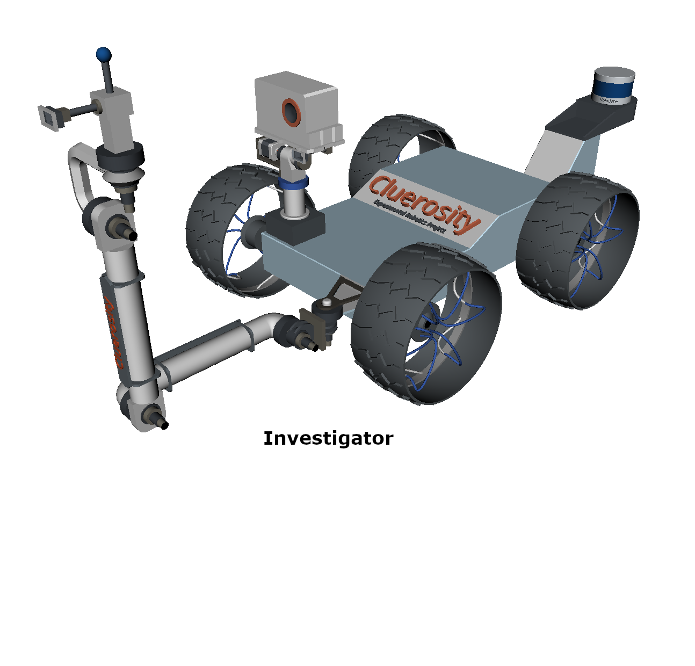
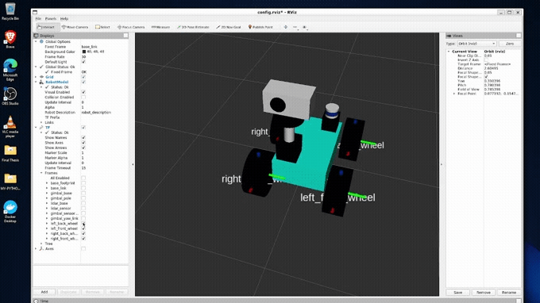
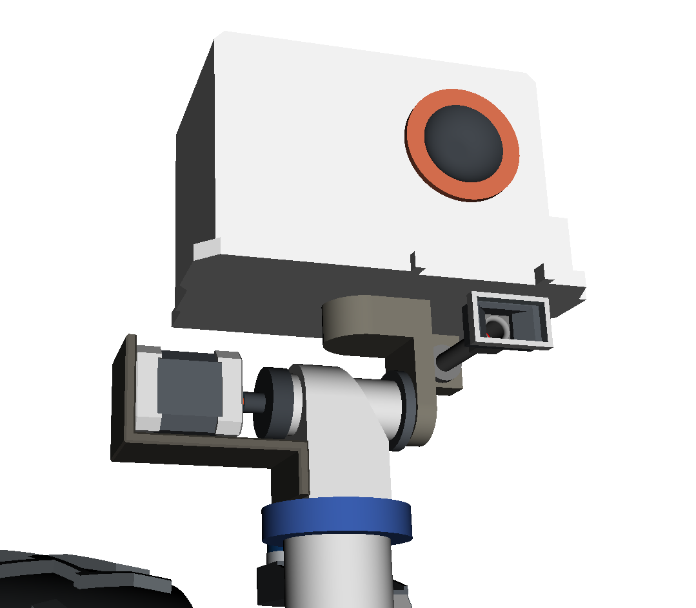
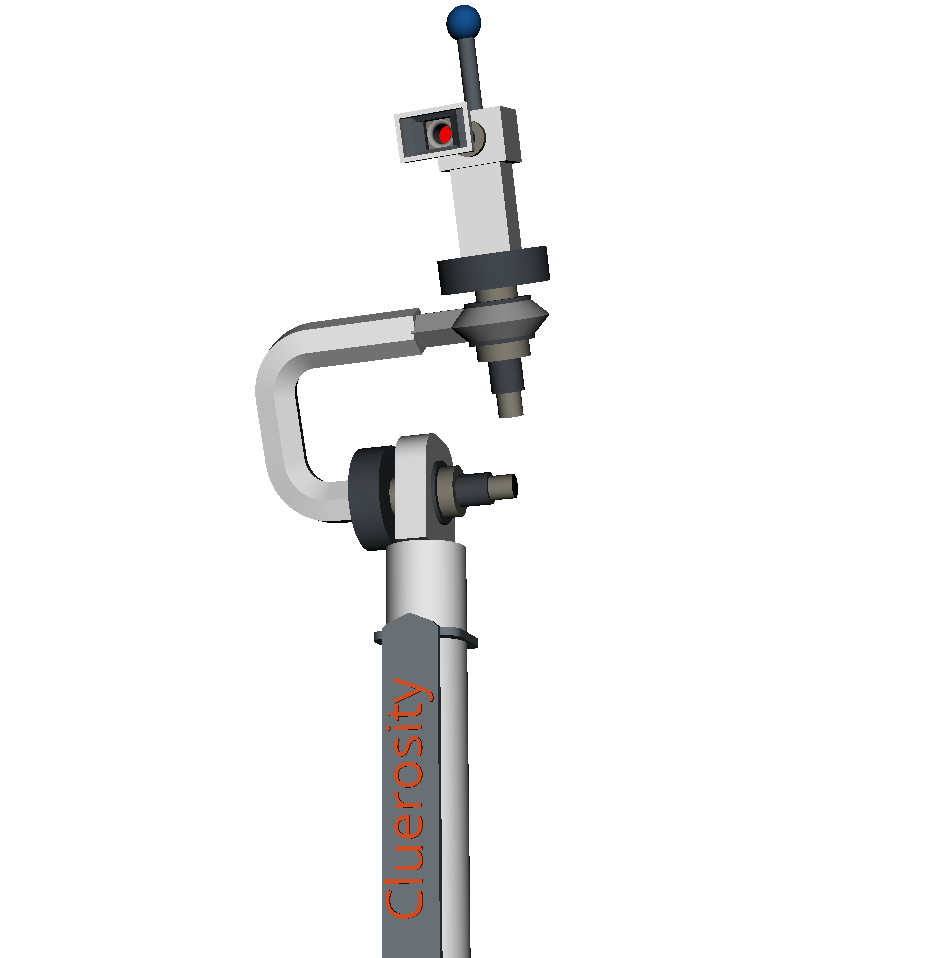
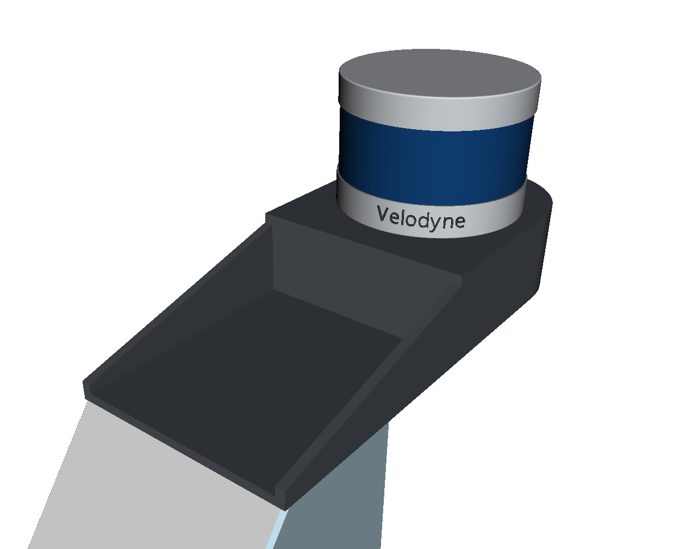

<a href="https://unige.it/en/">

</a>

>**Author: Omotoye Shamsudeen Adekoya**  
 **Email: adekoyaomotoye@gmail.com**  
 **Student ID: 5066348**  

# Outline

- Introduction
    - Robot Design
- ROS Packages
    - cluerosity_description
    - cluerosity_gazebo
    - cluerosity_slam 
    - cluerosity_navigation
    - cluerosity_moveit
    - cluerosity_unity
- System Limitations and Possible Improvements
- Installation Procedure

<div align="center">
<h1><strong>  Cluerosity </strong/></h1><br>

</div>

# Introduction

**Cluerosity** robot is a robot designed for ***and not limited to*** the [Experimental Robotics Lab Projects](https://github.com/Omotoye/Experimental-Robotics-Project). The Experimental Robotics Lab Projects are centered around a murder mystery board game called [Cluedo](https://en.wikipedia.org/wiki/Cluedo). The objective of the Cluedo game is to *determine __who__ murdered the game's victim, __where__ the crime took place, and __what__ weapon was used*. Each player assumes the role of one of the six suspects and attempts to deduce the correct answer by strategically moving around a game board representing the rooms of a mansion and collecting clues about the circumstances of the murder from the other players. A robotics scenario was created for this board game, where a robot is supposed to move into different rooms randomly or strategically acquire hints about the possible who, where, and what of the murder and then generate a hypothesis that would be taken to an oracle in a set location in the mansion to confirm if the hypothesis is correct. To acquire the said hints the robot has to be fitted with sensors like cameras for perceiving the environment a manipulator to pick out hints that are above ground level and also sensors that would help with navigation. 
>The name of the game being portrayed; *Cluedo* and inspiration from the *Curiosity Rover* sent to Mars to gather clues about the existence of life, birth the name *Cluerosity :slightly_smiling_face:*

## Robot Design 

Attached below are fun _.gifs_ files that show the timeline of the design of the robot; from the use of primitive shapes to meshes.

<br/>

<div align="center">


</div>
 

### Sensor Housing



The is a box standing on a gimbal, it houses an RGB, RGB-D camera, and a laser sensor. The sensor housing gimbal can *pan 360 degrees* and *tilt 20 degrees* up/down. The laser sensor is used by the slam packages to map the environment; which is then used by the navigation package to navigate to a goal point. The depth camera can be used for getting point cloud data of the environment to generate a 3D map of the environment. The RGB camera is used for getting image data which would be used to perceive hint data in the robotics Cluedo scenario. 

### Robot Manipulator 



This manipulator carries a camera for hint perception and a sherlock link pointer to also acquire hints in the second version of the experimental robotics project. The end effector carrying the camera and sherlock link has a continuous joint that allows it to turn 360 degrees. The manipulator link tree has 4 revolute joints leading to the end effect, so this helps with redundancy and allows the sherlock link to reach more points in the space in front of the robot. 

<br><br>
### Velodyne LiDAR



The Velodyne LiDAR is not used for any part of the project, so for now, it's just there as a prop and serves no actual use. Of course, if the project is to be adapted for a different project that might require such a sensor, a simple edit of the robot description would do the trick. 

<br><br>

# ROS Packages
Several packages were implemented for different functionalities required by the robot. Below is a general overview of each of the packages. 

## cluerosity_description

This is the package that contains the **urdf** of the package and all the files required for the urdf description of the robot. _Xacro_ files were implemented to modularize the urdf of this robot and then the urdf was generated from the xacro files. This package feature two launch files `display.launch` and `description.launch`. **_After following the installation procedure_** of this package run the launch file below to view the robot. 

```bash
roslaunch cluerosity_description display.launch # the default robot that would be launched is the explorer robot
```

_to launch the robot with the manipulator; **investigator**, use the launch file below_

```bash
roslaunch cluerosity_description display.launch type:=investigator 
```

The launch files above would load the robot description into the parameter server and the launch **rviz** with a customized configuration showing the robot in it; if you just want to load the robot description into the parameter server, use the launch file below. 

```bash
roslaunch cluerosity_description description.launch
```

The same goes here for the type of robot, if you require the robot with the manipulator, use the launch file below. 

```bash
roslaunch cluerosity_description description.launch type:=investigator
```

## cluerosity_gazebo 
This package contains launch files to spawn the robot into gazebo simulation and features several **[worlds](http://gazebosim.org/tutorials?tut=build_world)**, where the robot simulation can take place.  To spawn the robot into the gazebo, use the launch file below 

```bash
roslaunch cluerosity_gazebo gazebo.launch
```
_for now, by default, it'll spawn the **explorer** robot into the gazebo, still working on the spawning of the robot with the manipulator into gazebo_

## cluerosity_slam 
This package contains the implementation of various slam algorithms for use on this cluerosity robot. The slam algorithms implemented are highlighted below. 

- [gmapping](http://wiki.ros.org/gmapping); The gmapping package provides laser-based SLAM (Simultaneous Localization and Mapping), as a ROS node called slam_gmapping. Using slam_gmapping, you can create a 2-D occupancy grid map (like a building floorplan) from the laser and pose data collected by a mobile robot. __*After following the installation procedure*__ of the cluerosity project run the commands below to test the gmapping demo in the package. 

```bash
roslaunch cluerosity_slam gmapping_demo.launch
``` 

run the command below to move the robot around the environment to map the environment. 

```bash
rosrun teleop_twist_keyboard teleop_twist_keyboard.py
```

if everything was done properly, it should look something like what is in the video below.
  
<details><summary>Gmapping Demo Video</summary>
        
        
https://user-images.githubusercontent.com/67521465/164301875-b0b6d5cc-7908-4606-bf33-3176e75f107a.mp4
</details>

- [karto-slam](http://wiki.ros.org/slam_karto); KartoSLAM is a graph-based SLAM approach developed by SRI International’s Karto Robotics, which has been extended for ROS by using a highly-optimized and
noniterative Cholesky matrix decomposition for sparse linear systems as its solver 
In the KartoSLAM version available for ROS, the Sparse Pose Adjustment (SPA) is responsible for both scan matching and loop-closure procedures. The higher the number of landmarks, the more amount of memory is required. _*After following the installation procedure*__ of the cluerosity project run the commands below to test the karto-slam demo in the package. 

```bash
roslaunch cluerosity_slam karto_slam_demo.launch
``` 

run the command below to move the robot around the environment to map the environment. 

```bash
rosrun teleop_twist_keyboard teleop_twist_keyboard.py
```

if everything was done properly, it should look something like what is in the video below. 
    
 <details><summary>Karto-Slam Demo Video</summary>   

https://user-images.githubusercontent.com/67521465/164304709-c04feca5-eab7-4b3e-a480-8ea28310ee96.mp4
</details>

- [octomap](http://wiki.ros.org/octomap); The Octomap library implements a 3D occupancy grid mapping approach, based on an octree, with the following 
feature:
    - **Full 3D model**. The map can model arbitrary environments without prior assumptions about them. The 
representation models occupied areas as well as free space. Unknown areas of the environment are implicitly 
encoded in the map. While the distinction between free and occupied space is essential for safe robot navigation, 
information about unknown areas is important, e.g., for autonomous exploration of an environment.
    - **Updatable**. It is possible to add new information or sensor readings at any time. Modeling and updating are done in 
a probabilistic fashion. This accounts for sensor noise or measurements which result from dynamic changes in the 
environment, e.g., because of dynamic objects. Furthermore, multiple robots can contribute to the same 
map and a previously recorded map is extendable when new areas are explored.
    - **Flexible**. The extent of the map does not have to be known in advance. Instead, the map is dynamically expanded 
as needed. The map is multi-resolution so that, for instance, a high-level planner can use a coarse map, while 
a local planner may operate using a fine resolution. This also allows for efficient visualizations which scale from 
coarse overviews to detailed close-up views.
    - **Compact**. The map is stored efficiently, both in memory and on disk. It is possible to generate compressed files for 
later usage or convenient exchange between robots even under bandwidth constraints. 

Please notice that Octomap is not a SLAM algorithm, since it does not implement any attempts of improving the 
robot localization or the knowledge of the surrounding environment

*Taken from [Prof Carmine Recchiutto's](https://github.com/carmined8) note*

_*After following the installation procedure*__ of the cluerosity project run the commands below to test the octomap demo in the package. 

```bash
roslaunch cluerosity_slam octomap_demo.launch
``` 

run the command below to move the robot around the environment to map the environment. 

```bash
rosrun teleop_twist_keyboard teleop_twist_keyboard.py
```

if everything was done properly, it should look something like what is in the video below. 
    
 <details><summary>Octomap Demo Video</summary>   

https://user-images.githubusercontent.com/67521465/164307763-33b2944a-092f-40ac-9fce-feb2058f2ed0.mp4
</details>


- [slam-toolbox](https://github.com/SteveMacenski/slam_toolbox); This package, slam_toolbox is open-source under an LGPLv2.1 at [SteveMacenski](https://github.com/SteveMacenski/slam_toolbox.git) and is available in every current ROS distribution. It was
also selected as the new default SLAM vendor in ROS 2, the second generation of robot
operating systems, replacing GMapping. SLAM Toolbox was integrated into the new ROS 2
Navigation2 project, provides real-time positioning in dynamic environments for autonomous
navigation (Macenski, Martín, et al., 2020). It has been shown to map spaces as large as
24,000 m2 [The Journal of Open Source Software](https://joss.theoj.org/papers/10.21105/joss.02783)
This package subscribes to `sensor_msgs/LaserScan` in the `/laser_scan` topic and tf message in the`/tf` and uses the message to generate a `nav_msgs/OccupancyGrid` and publishes it to the `/map` topic message. It also helps the robot Localize itself to the environment.

_*After following the installation procedure*__ of the cluerosity project run the commands below to test the slam-toolbox demo in the package. 

```bash
roslaunch cluerosity_slam slam_toolbox_demo.launch
``` 

run the command below to move the robot around the environment to map the environment. 

```bash
rosrun teleop_twist_keyboard teleop_twist_keyboard.py
```

if everything was done properly, it should look something like what is in the video below. 
    
<details><summary>slam-toolbox Demo Video</summary>   

https://user-images.githubusercontent.com/67521465/164309605-f8d5bda9-1361-4187-8908-ac03a784183e.mp4
</details>


## cluerosity_navigation 
This package was created to enable the robot to navigate autonomously in an unknown environment. It uses [move_base](http://wiki.ros.org/move_base) package from [ROS Navigation Stack](http://wiki.ros.org/navigation?distro=noetic) to autonomously navigate the cluerosity robot from one point to some goal point. A demo has been prepared in the cluerosity_navigation package that uses the map generated from the gmapping slam (any of the slam package implemented can be used) to help move_base navigate the robot in an environment. 

This package also implements the package [explore-lite](http://wiki.ros.org/explore_lite) to map an unknown environment, this package provides greedy frontier-based exploration. When node is running, robot will greedily explore its environment until no frontiers could be found. Movement commands will be sent to move_base. A demo launch file was also implemented to showcase this ability. 


_*After following the installation procedure*__ of the cluerosity project run the commands below to test the navigation demo in the package. 

```bash
roslaunch cluerosity_navigation move_base_demo.launch
``` 

After launching the package, see the video below to see how to send a goal coordinate from `rviz`
    
<details><summary>Navigation Demo Video</summary>   

https://user-images.githubusercontent.com/67521465/164321309-a2d68918-f659-4838-9594-b7355223ad9f.mp4
</details>


Enter the command below to see the demo for launching the `explore-lite` package to map an environment. 

```bash
roslaunch cluerosity_navigation explorer_demo.launch    
```
see the video of the demo below. 

<details><summary>Explorer Demo Video</summary>
    
    
https://user-images.githubusercontent.com/67521465/164319491-154e5427-87f0-4bed-bf90-aa110ec8ef3e.mp4
</details>
    
## cluerosity_moveit  

🚧 working on it... 

## cluerosity_unity   

🚧 working on it...  

# System Limitations and Possible Improvements 
    
# Installation Procedure

The ros packages in this project has several dependencies, enter the commands below to intall the package and it's requried packages. 

>**NB**: The instructions below are meant for packages that are written for _**ROS Noetic Ninjemys**_.


First, you create a folder for your catkin workspace

```bash
mkdir -p ~/catkin_ws/src
```

Clone the package repository

```bash
cd ~/catkin_ws/src
git clone https://github.com/Omotoye/cluerosity.git
```

Once the package has been successfully cloned, you need to get all the dependencies below before building the workspace. 

### Dependencies

SLAM_packages _(from Prof Carmine's github)_, it contains almost all the dependencies for the `cluerosity_slam` package

```bash
cd ~/catkin_ws/src
git clone https://github.com/CarmineD8/SLAM_packages
cd ~/catkin_ws/src/SLAM_packages
git checkout noetic 
```
```bash
sudo apt-get install libsuitesparse-dev 
sudo apt-get install ros-noetic-openslam-gmapping
```

for the slam-toolbox, run the commands below 
```bash
cd ~/catkin_ws/src
git clone https://github.com/SteveMacenski/slam_toolbox

cd ~/catkin_ws/src/slam_toolbox
git checkout noetic-devel
```

for the control of the manipulator links 
```bash
sudo apt-get install ros-noetic-ros-control ros-noetic-ros-controllers
sudo apt-get install ros-noetic-gazebo-ros-pkgs ros-noetic-gazebo-ros-control
```

for moveit
```bash
sudo apt-get install ros-noetic-moveit 
sudo apt-get install ros-noetic-moveit-resources-prbt-moveit-config
```

for navigation package
```bash
sudo apt-get install ros-noetic-navigation
cd ~/catkin_ws/src
git clone https://github.com/CarmineD8/m-explore
git clone https://github.com/CarmineD8/planning
```

to get all the remaining dependencies
```bash
# run this command in the catkin_ws folder
cd ~/catkin_ws
rosdep install -q -y -r --from-paths src --ignore-src 
```

**Now you can build the package**, run the command below to build the package. 
> You can use `catkin_make` or `catkin build`, but anyone you use, you have to stick with it. 

```bash
cd ~/catkin_ws
catkin_make 
```
OR 
```bash
cd ~/catkin_ws
catkin build 
```
**_You can now run all the demos shown in the ROS Pacakges section_** 

_Enjoy!!!_
